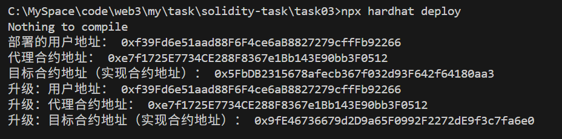
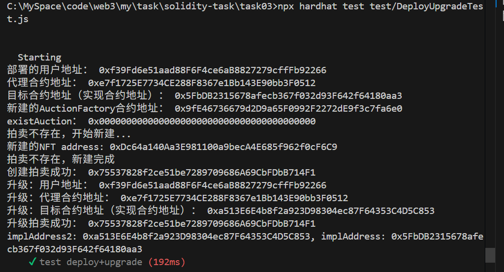

## 测试流程
* 项目结构
    * task03---根目录
    * constracts----合约目录
        * auctionmarket----拍卖市场合约
            * Auction.sol：基本的竞拍合约
            * AuctionFactory.sol：Uniswap V2工厂合约
            * AuctionMarket.sol：竞拍市场合约（管理入口，同时只能有一场合约进行中）
            * AuctionNFTReceiver.sol：跨链消息接收处理合约
        * bid----ERC721拍品目录
            * NFTBid.sol：ERC721拍品合约
        * erc20----ERC20代币目录
            * MyToken.sol：ERC20代币合约
        * deploy----部署合约目录
            * 01_deploy_auction_market.js：部署脚本
            * 02_upgrade_erc20_token.js：升级脚本
        * script----脚本目录(跨链接收者脚本)
            * AuctionNFTReceiverDeploy.js----部署跨链接收者脚本
        * test----测试目录
            * AuctionMarketBasic.js：基本功能测试脚本，不包括跨链及部署升级功能
            * CrossChainTest.js：跨链发送者测试脚本

* 基本功能测试：NFT合约创建、拍卖合约的创建（Uniswap V2）/竞拍/结束竞拍/动态手续费/比对最终的结果
    * 需要先将AuctionMarket.sol的构造函数注释去除。为了满足部署升级，最终代码将构造函数注释掉了。
    * 测试脚本：test/AuctionMarketBasic.js
    * 本地测试即可：进入task03目录，执行：npx hardhat test test/AuctionMarketBasic.js
* 跨链功能测试
    * 需要先将AuctionMarket.sol的构造函数注释去除。为了满足部署升级，最终代码将构造函数注释掉了。
    * 先部署跨链合约节点，使用sepolia测试网，部署脚本：script/AuctionNFTReceiverDeploy.js，执行指令： npx hardhat run script/AuctionNFTReceiverDeploy.js --network sepolia
    * 执行测试脚本，发起跨链请求，使用hoodi测试脚本（hoodi太新不支持跨链，跨链目前未全链路验证成功）：test/CrossChainTest.js，执行指令：npx hardhat test test/CrossChainTest.js --network hoodi
* 合约部署/升级（采用UUPS）：AuctionMarket实现UUPS即可。
    * AuctionMarket 是用户交互的主要入口，需要支持升级业务逻辑，要实现UUPS
    * AuctionFactory 和 Auction 是每次拍卖的独立实例，无需升级。升级AuctionMarket时独立创建即可。
    * 部署+升级指令：npx hardhat deploy
    
    * 部署+升级的单元测试，实现升级，指令：npx hardhat test test/DeployUpgradeTest.js
    